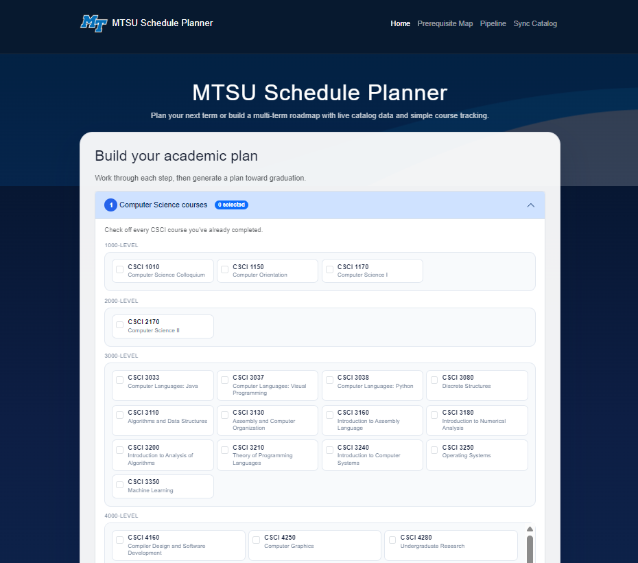
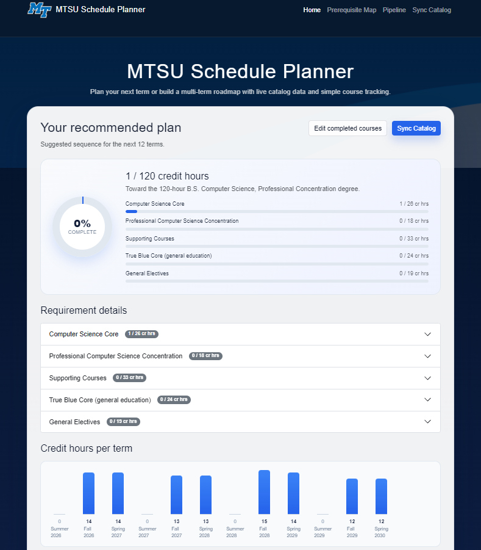
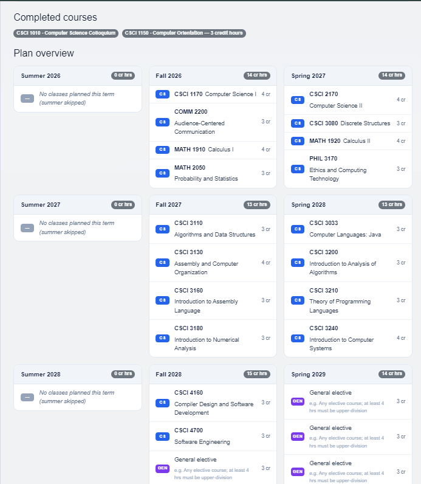
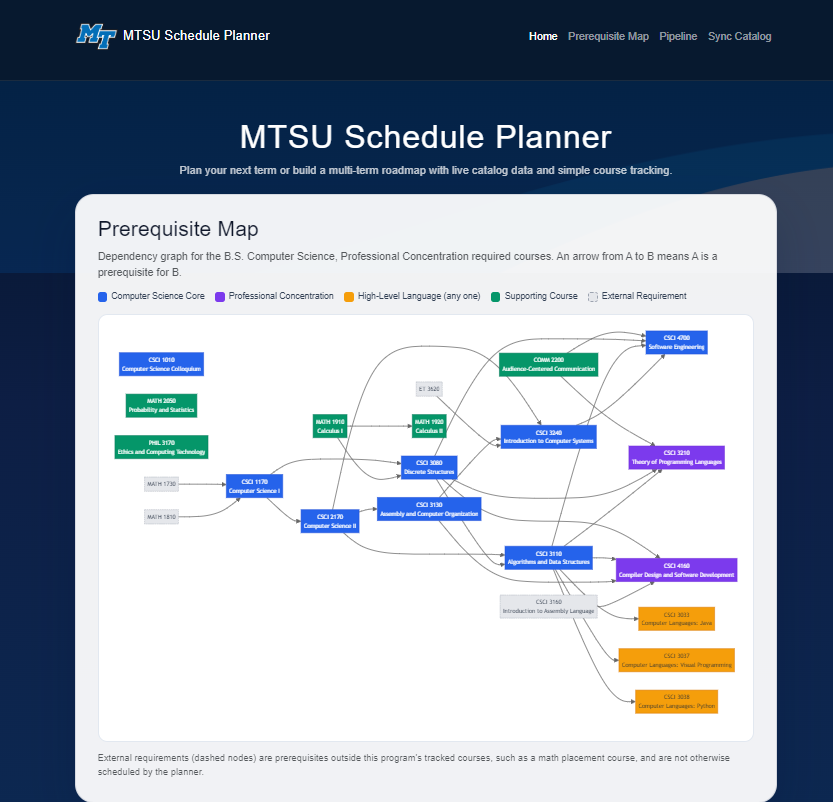

# MTSU GradPath

A degree-progress and term-planning tool for MTSU's B.S. Computer Science, Professional Concentration. It scrapes MTSU's undergraduate course catalog, audits completed coursework against the degree's 120-hour requirement structure, and generates a term-by-term schedule that respects prerequisite ordering.

Live demo: **https://mtsu-gradpath.onrender.com**
Video walkthrough: **https://youtu.be/ePZ4cazj3Gw**

| | |
|---|---|
|  |  |
|  |  |

---

## Installation

1. Create a virtual environment and install dependencies:

   **Linux / macOS**
   ```bash
   python3 -m venv .venv && source .venv/bin/activate
   pip install -r requirements.txt
   ```
   **Windows (PowerShell)**
   ```powershell
   python -m venv .venv; .venv\Scripts\Activate.ps1
   pip install -r requirements.txt
   ```

2. Set a `SECRET_KEY` — **required**, `app.py` reads it via `os.environ["SECRET_KEY"]` and will not start without it:

   ```bash
   cp .env.example .env
   # edit .env and set SECRET_KEY to the output of:
   python -c "import secrets; print(secrets.token_hex(32))"
   ```

3. Run it and open `http://127.0.0.1:5000`:

   ```bash
   python app.py
   ```

### Running on JupyterHub

1. Upload/clone this folder into your JupyterHub home directory.
2. Open a **Terminal** (not a notebook cell) and follow steps 1–3 above exactly as on Linux.
3. JupyterHub doesn't expose `127.0.0.1:5000` directly — use the hub's proxy path instead:
   ```
   https://<your-jupyterhub-domain>/user/<your-username>/proxy/5000/
   ```
   If `jupyter-server-proxy` isn't installed on the hub, ask the instructor for the proxy URL pattern used there.

---

## Configuration

Read via `mtsugradpath/config.py`, settable in `.env` or as shell env vars:

| Variable | Default | Description |
|---|---|---|
| `SECRET_KEY` | *(required)* | Flask session signing key |
| `DATABASE_URL` | `sqlite:///data/mtsu_courses.db` | SQLAlchemy connection string; PostgreSQL also supported |
| `MTSU_CATALOG_URL` | `https://catalog.mtsu.edu` | Base URL for the catalog widget API |
| `MTSU_CATALOG_IDS` | `46` | Catalog ID(s) to sync (46 = undergraduate) |
| `MTSU_PROGRAM_PREFIX` | `CSCI` | Course prefix the sync/planner are scoped to |

---

## Usage

1. On the home page, click `Sync Catalog` to populate the database from MTSU's live catalog.
2. Check off completed CSCI courses (grouped by level); use search to add supporting courses (MATH 1910, COMM 2200, PHIL 3170, etc.).
3. Enter completed hours for non-CSCI buckets (math elective, science sequences, True Blue Core, general electives).
4. Pick a starting term/year, number of terms to plan, and whether to include summers, then submit.
5. Review the result: completion percentage, per-category breakdown, credit-hours-per-term chart, term-by-term schedule, and any prerequisite warnings.
6. Use `Prerequisite Map` in the nav bar to view the course dependency graph independently of a generated plan.

Run the catalog sync standalone: `python scrape_courses.py`

---

## Testing

```bash
python -m pytest tests
```

Covers term generation, prerequisite gating, requirement-bucket handling, `validate_plan` (including a regression test for a same-term-prerequisite defect that was fixed in `planner.py`), and `course_offered_in_term` against published department scheduling patterns.

---

## Architecture

```
app.py                 Flask routes: / (form + plan), /prerequisites, /sync
scrape_courses.py      CLI entry point for the catalog sync
mtsugradpath/
├── config.py          Env configuration
├── db.py              SQLAlchemy engine/session
├── models.py          ORM: Course, CourseType, Prerequisite
├── scraper.py         Catalog widget API client + DB sync
├── degree.py          Requirement definitions + audit logic
└── planner.py         Term scheduling (generate_plan) + validation (validate_plan)
templates/, static/    Jinja templates, CSS/assets
tests/                 pytest suite
data/                  Local SQLite file (gitignored)
```

**Scheduling:** `generate_plan()` fills each term toward a target credit-hour load, in priority order: required CSCI core/concentration courses, then supporting courses (MATH/COMM/PHIL), then general-requirement buckets — all gated by prerequisites parsed from the synced catalog and by published course-offering seasons (`course_offered_in_term`, e.g. fall-only or odd-year-spring-only courses). `validate_plan()` independently re-checks the generated plan and surfaces a warning banner if any course precedes its prerequisite.

**Degree model:** `mtsugradpath/degree.py` encodes the 120-hour requirement structure — CS Core (26h), Professional Concentration (18h), Supporting Courses (33h), True Blue Core (24h), and Electives (19h, the remainder) — as a mix of specific required courses and partial-hour buckets for flexible/general-education requirements.

**Prerequisite Map:** `/prerequisites` renders required-course dependencies as a Mermaid.js graph (`build_prereq_graph`), scoped to required courses rather than the full CSCI catalog.

---

## Deployment

Hosted on [Render](https://render.com) (`stevenGGG23/MTSU-GradPath`, `main`, auto-deploy). Build: `pip install -r requirements.txt`. Start: `gunicorn app:app --bind 0.0.0.0:$PORT` (see `Procfile`). Requires `SECRET_KEY`; `DATABASE_URL` is optional (falls back to local SQLite, which does not persist on Render's ephemeral filesystem).

---

## Known Limitations

- Course-offering data covers only published undergraduate CSCI patterns; graduate courses and unpublished exceptions aren't modeled.
- Only the undergraduate catalog (ID 46) syncs by default; scope is `CSCI`-prefixed courses only (no cross-listed prefixes).
- No persistence of user input across requests — completed courses/hours are re-entered each time.
- Scoped to a single program: B.S. CS, Professional Concentration.

---

## Project Background

Originated from a course proposal (Statement of Scope, July 15, 2026) under group name "Future FANG." The objective — generate an optimal graduation path from completed coursework — is unchanged; the implementation diverged from the proposal in several ways: SQLite/SQLAlchemy replaced flat JSON files, catalog data is scraped automatically instead of hand-entered, the UI is a Flask web app instead of a desktop GUI, and charts are CSS-based instead of matplotlib. See git history for the full evolution.

## Acknowledgements

- Middle Tennessee State University Undergraduate Catalog
- Flask
- SQLAlchemy
- Bootstrap
- Mermaid.js
- Render

---

## Team

Steven Gobran, Beshoy Azrak, Caleb Lykens, Mina Youssef Eshak

## License

Developed for educational purposes as part of a university Computer Science course project.
